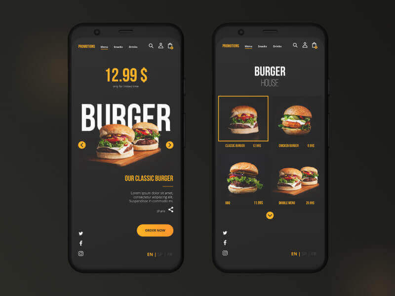

    <h1 style="color: orangered;">Load more - load more button with custom coding</h1> 
    <h2>Click here for live view: <a href="https://mhfaysal124.github.io/load_more_button./" target="blank">Demo</a></h2>
<h2 style="color: orangered;">1. HTML code formate: </h2> 
    

          

            
            <h3 class="text-white text-center bg-danger p-3 fw-bold">MH Faysal</h3>
          

          

            
            <h3 class="text-white text-center bg-danger p-3 fw-bold">MH Faysal</h3>
          
 

          

            
            <h3 class="text-white text-center bg-danger p-3 fw-bold">MH Faysal</h3>
          
      

          

            
            <h3 class="text-white text-center bg-danger p-3 fw-bold">MH Faysal</h3>
          

          

            
LOAD MORE

          

<h2 style="color: orangered;">1. Activation code: </h2> 

      $(document).ready(function(){
        $(".col-lg-4").slice(0,3).show()
        $(".btn").on("click", function(){
            $(".col-lg-4:hidden").slice(0,3).slideDown()
            if($(".col-lg-4:hidden").length==0){
                $(".btn").fadeOut('slow')
            }
        })
      })

  

   <h1>Connect with MH Faysal</h1>
    <h2>LinkedIn profile: <a href="https://www.linkedin.com/in/mhfaysal124/">LinkedIn</a></h2>
    <h2>Facebook page: <a href="https://www.facebook.com/mhfaysal124">Facebook</a></h2>
    <h2>My website: <a href="https://www.mhfaysal.com">MH Faysal</a></h2>
